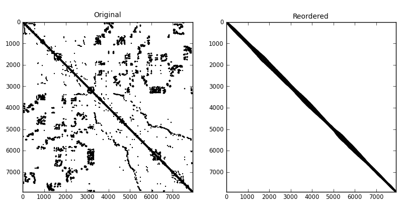

.. Description of pymc60 module
.. _pymc60-page:

=======================================
Profile, Wavefront, Bandwidth Reduction
=======================================

The :mod:`pymc60` Module
========================

.. automodule:: pyorder.pymc60.pymc60

Functions available
-------------------

.. autofunction:: sloan

.. autofunction:: rcmk

.. autofunction:: reorder_matrix

Examples
========

Basic Usage
-----------

The first example is the one from the documentation of the HSL subroutine MC60.
In it, we call the Fortran subroutines directly. As before, this means that all
indices must be 1-based. The permutation vector and indices of the
supervariables are also 1-based.

.. literalinclude:: ../../examples/demo_mc60.py
   :linenos:

Python Interface
----------------

The Python interface provides smoother and more intuitive application of
Sloan's and the reverse Cuthill-McKee methods by way of the :func:`sloan` and
:func:`rcmk` functions. At the same time, we use input data in either
Harwell-Boeing or Rutherford-Boeing format.

.. literalinclude:: ../../examples/demo_hb_mc60.py
   :linenos:

For illustration, here is the result of this example on a problem from the
`University of Florida Sparse Matrix Collection
<http://www.cise.ufl.edu/research/sparse/matrices>`_. I used matrix
`commanche_dual
<http://www.cise.ufl.edu/research/sparse/matrices/Pothen/commanche_dual.html>`_
in Rutherford-Boeing format.

Here is the matrix reordered according to Sloan's algorithm.

.. image:: commanche_dual_sloan.png

Here it is reordered according to the reverse Cuthill-McKee algorithm.

.. .. plot::

..    from numpy import linspace, sin
..    import matplotlib.pylab as plt
..    x = linspace(0.01,25, 10000)
..    plt.plot(x, sin(x)/x)
..    plt.show()

